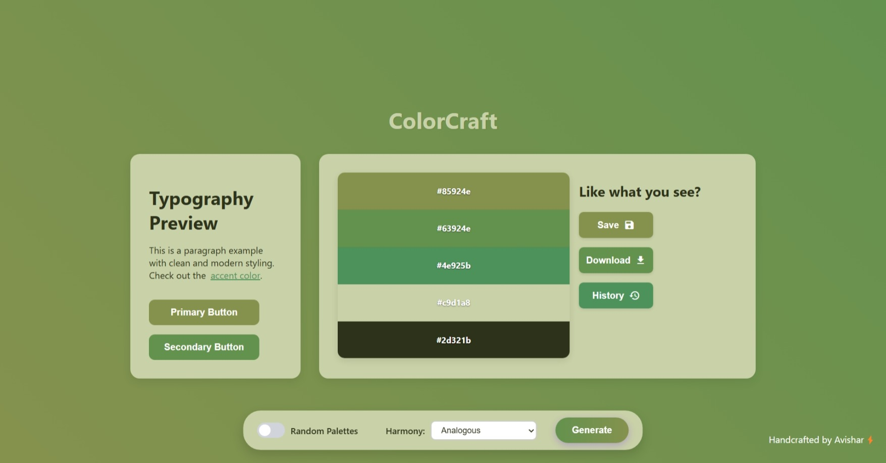
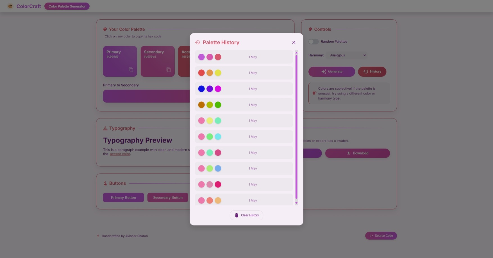
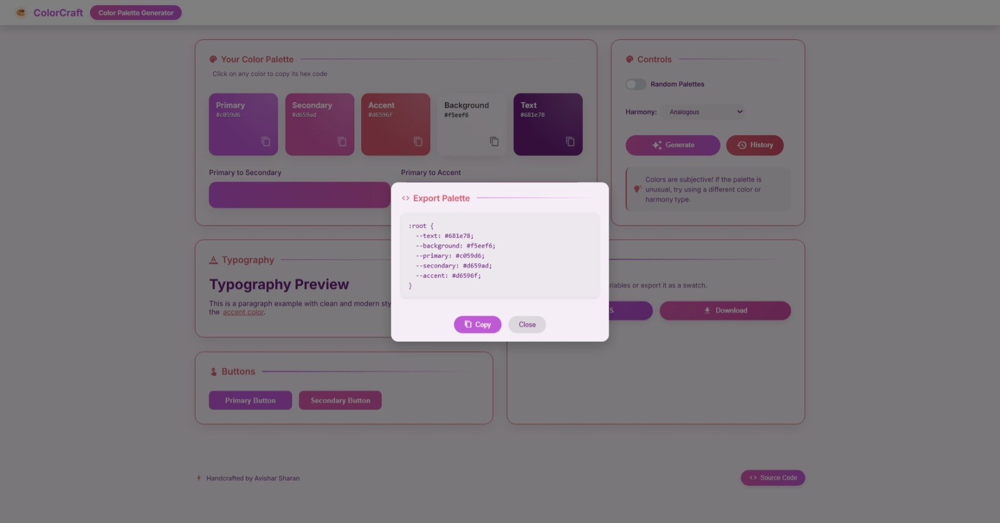

# ColorCraft

<div align="center">
  <h3>Color Palette Generator</h3>
  <p>Create harmonious color schemes for your design projects with ease</p>
  

  
  
  
</div>

<br>

### Deployed Link: [ColorCraft](color-craft-chi.vercel.app)

## ✨ Features

- **🎨 Instant Palette Generation** - Create beautiful color palettes with a single click
- **🧩 Multiple Harmony Types** - Choose from Analogous, Monochromatic, Triadic, Complementary, Split-Complementary, and Tetradic color harmonies
- **🖌️ Custom Base Color** - Start with your own base color using the intuitive color picker
- **⏱️ Palette History** - Access and reuse previously generated palettes with persistent local storage
- **👁️ Live Theme Preview** - See your palette applied to typography, buttons, and UI elements in real-time
- **📤 Multiple Export Options**:
  - Copy color values as CSS variables
  - Download palette as a ZIP package with PNG swatch and CSS variables
  - Quick-copy individual color hex codes

## 📸 Screenshots

<div align="center">
  
  <br><br>
  
  <br><br>
  
</div>

## 🛠️ Technology Stack

- **⚛️ React** - UI library for building the interface
- **⚡ Vite** - Fast build tool and development server
- **🎭 Chroma.js** - Color manipulation library
- **📦 JSZip & FileSaver** - For creating and downloading zip archives
- **🔍 Material Icons** - For UI iconography

## 🚀 Getting Started

### Prerequisites

- Node.js (v16 or higher)
- npm or yarn

### Installation

1. **Clone the repository**
   ```bash
   git clone https://github.com/AvisharSharan/ColorCraft.git
   cd ColorCraft
   ```

2. **Install dependencies**
   ```bash
   npm install
   # or
   yarn install
   ```

3. **Start the development server**
   ```bash
   npm run dev
   # or
   yarn dev
   ```

4. **Open your browser** and navigate to `http://localhost:5173`

## 🧠 How It Works

ColorCraft uses advanced color theory algorithms to generate harmonious color palettes:

1. Selects base colors using color harmony principles
2. Applies intelligent brightness and saturation adjustments
3. Ensures color accessibility and visual balance
4. Generates text colors with appropriate contrast ratios

## 🧩 Project Structure

```
src/
├── components/         # React components
│   ├── ButtonPreview.jsx
│   ├── ExportModal.jsx
│   ├── FeaturesSection.jsx
│   ├── Footer.jsx
│   ├── Header.jsx
│   ├── PaletteDisplay.jsx
│   ├── PaletteGenerator.jsx
│   ├── PaletteHistory.jsx
│   ├── ThemePreview.jsx
│   ├── Toolbar.jsx
│   └── TypographyPreview.jsx
├── styles/             # Component CSS files
├── App.jsx             # Main application component
└── main.jsx            # Application entry point
```

## 📝 User Guide

1. **Generate a Palette**
   - Click the "Generate" button to create a new random color palette
   - Toggle "Use Base Color" to start with your own chosen color
   - Select different harmony types to explore color relationship options

2. **Customize Your Palette**
   - View live previews of your palette in different UI contexts
   - See typography and button styling with your palette

3. **Save Your Work**
   - Access palette history to view and reuse previous palettes
   - Copy CSS variables for direct use in your projects
   - Download a ZIP containing PNG swatch and text files
   - Click individual color cards to copy specific hex codes

## 👏 Acknowledgments

- Built as a project for Google Developer Group On Campus SRM recruitment task
- Inspired by modern design tool workflows and color theory principles
- Uses [Chroma.js](https://gka.github.io/chroma.js/) for color manipulation

<div align="center">
  <p>Handcrafted by Avishar ⚡</p>
  <p>
    <a href="https://github.com/AvisharSharan">GitHub</a> •
    <a href="https://twitter.com/AvisharS">Twitter</a> •
    <a href="https://linkedin.com/in/avishars">LinkedIn</a>
  </p>
</div>
