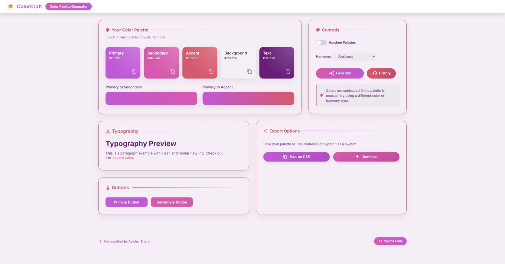

# Color Palette Generator


A modern, interactive color palette generator built with React and Vite that helps designers and developers create harmonious color schemes for their projects.

## Features

- **Instant Palette Generation**: Create beautiful color palettes with a single click
- **Custom Base Color**: Option to start with your own base color using the color picker
- **Palette History**: Access and reuse previously generated palettes with unlimited history
- **Live Theme Preview**: See your palette applied to typography, buttons, and UI elements in real-time
- **Multiple Export Options**:
  - Save color values as CSS variables
  - Download palette as a ZIP package with PNG preview and CSS variables
  - Copy individual color codes in HEX format

## Screenshot




## Technology Stack

- **React**: UI library for building the interface
- **Vite**: Fast build tool and development server
- **Chroma.js**: Color manipulation library
- **JSZip & FileSaver**: For creating and downloading zip archives
- **Material Icons**: For UI iconography

## Getting Started

### Prerequisites

- Node.js (v16 or higher)
- npm or yarn

### Installation

1. Clone the repository:
```bash
git clone https://github.com/yourusername/ColorPaletteGenerator.git
cd ColorPaletteGenerator
```

2. Install dependencies:
```bash
npm install
# or
yarn install
```

3. Start the development server:
```bash
npm run dev
# or
yarn dev
```

4. Open your browser and navigate to `http://localhost:5173`

## Project Structure

```
src/
├── components/         # React components
│   ├── ButtonPreview.jsx
│   ├── ExportModal.jsx
│   ├── FeaturesSection.jsx
│   ├── Footer.jsx
│   ├── Header.jsx
│   ├── PaletteDisplay.jsx
│   ├── PaletteHistory.jsx
│   ├── ThemePreview.jsx
│   ├── Toolbar.jsx
│   └── TypographyPreview.jsx
├── styles/             # Component CSS files
│   ├── App.css
│   ├── ButtonPreview.css
│   └── ...
├── App.jsx             # Main application component
└── main.jsx            # Application entry point
```

## Usage

1. **Generate a Palette**: Click the "Generate" button to create a new random color palette
2. **Use a Base Color**: Toggle the "Use Base Color" option and select your preferred base color
3. **View History**: Click the "History" button to see and reuse previously generated palettes
4. **Export**: Click the "Save" button to copy CSS variables or "Download" to get a ZIP file

## Acknowledgments

- Built as a project for Google Developer Group On Campus SRM recruitment task
- Inspired by modern design tool workflows

Handcrafted by Avishar ⚡
